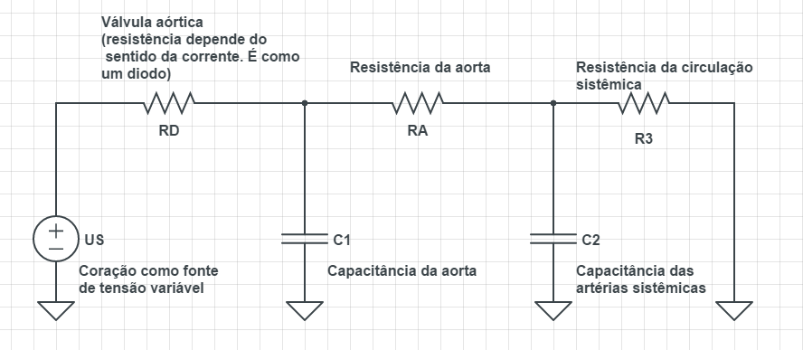

# Estrutura das pastas

``data/`` tem sinais de pressão arterial reais, extraídos da *MIMIC database* (usados para análise via Fourier).

``refs/`` (que só existe no repositório local, ou seja, não está no Github), contém os artigos, livros e links de onde a ideia do modelo foi tirada.

``circuito*.m``, ou seja, os arquivos de extensão ``.m`` que começam com a palavra ``circuito``, são versões do modelo (afinal, o modelo é um circuito elétrico).

``plotATM.m`` e ``getScaledATM.m`` são funções para processar os dados de ``data/``, convertendo-os em vetores do MATLAB.

``elastanciaCoracao.m`` é uma função que modela a elastância do coração ao longo do ciclo cardíaco.

Fim !

# circuitoRCDuplo.m

Modela um circuito com dois capacitores (um para a aorta, outro para todas as artérias sistêmicas). 

O coração é tratado como fonte variável (é possível modelar suas quatro câmaras, mas não fiz isso ainda)

Circuito modelado pelo script

# circuitoRCL.m

Incluirá indutores para simular as reflexões das ondas de pressão ao longo das artérias (ao que parece, o sangue faz um movimento de "vai-e-volta" que os circuitos anteriores não conseguem simular).

Por enquanto, este script tem dois indutores (um para a aorta, outro para as artérias sistêmicas), mas o arranjo deles no circuito (que deve estar errado) fez com que eles não mudassem em nada os resultados da simulação (é como se não existissem).